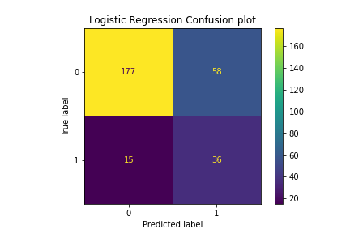

<h1>Readme</h1>

<h2>Introduction</h2>
<h3>Problem Statement</h3>

The idea behind this project is for and foremost a practical one, it breaks down to a simple question, "can we predict attrition?" The motivation for answering this question is clear; many companies face an issue with attrition. This project takes a dataset provided by IBM (https://www.kaggle.com/pavansubhasht/ibm-hr-analytics-attrition-dataset )and strives to create a model that can reasonably predict when an employee is likely to leave a company. 

<h3>Stakeholders</h3>

The stakeholders for this project are simply the hr department of a given company seeking to understand the causes of attrition in their employees.

<h3>Deliverables</h3>

A model that can be used via a graphical user interface to create data visualizations useful for tracking several factors in attrition.

<h2>Project Organization</h2>

<table class="tg">
<thead>
  <tr>
      <td class="tg-0lax">Folder</td><td>Purpose</td>
  </tr>
</thead>
    <tr><td>cpp_code</td><td>Python Modules written in c++</td></tr>
    <tr><td>fonts</td><td>Font Files</td></tr>
    <tr><td>jupyter_notebooks</td><td>Files used for eda, munging and modeling.</td></tr>
    <tr><td>models</td><td>Predictive models generated elsewhere.</td></tr>
    <tr><td>output</td><td>Storage location for datavisualization output.</td></tr>
    <tr><td>pickles</td><td>Used for storing python objects written in binary.</td></tr>
    <tr><td>python_code</td><td>Application and associated files.</td></tr>
</table>

<h2>Data Dictionary</h2>

<table class="tg">
<thead>
  <tr>
    <th class="tg-0lax">Variable</th>
    <th class="tg-0lax">Info</th>
  </tr>
</thead>
<tbody>
  <tr>
    <td class="tg-0lax">Age</td>
    <td class="tg-0lax">Employee age</td>
  </tr>
  <tr>
    <td class="tg-0lax">BusinessTravel</td>
    <td class="tg-0lax">0- Never; 1-Somtimes; 2-Frequent</td>
  </tr>
  <tr>
    <td class="tg-0lax">DailyRate</td>
    <td class="tg-0lax">Amount earned per day.</td>
  </tr>
  <tr>
    <td class="tg-0lax">DistanceFromHome</td>
    <td class="tg-0lax">Distance in miles</td>
  </tr>
  <tr>
    <td class="tg-0lax">Education</td>
    <td class="tg-0lax">1-5</td>
  </tr>
  <tr>
    <td class="tg-0lax">EducationField</td>
    <td class="tg-0lax">Life Sciences; Medical; Marketing; Technical Degree; Other; Human Resources</td>
  </tr>
  <tr>
    <td class="tg-0lax">EnvironmentSatisfaction</td>
    <td class="tg-0lax">1-4</td>
  </tr>
  <tr>
    <td class="tg-0lax">HourlyRate</td>
    <td class="tg-0lax">Hourly Rate</td>
  </tr>
  <tr>
    <td class="tg-0lax">JobInvolvement</td>
    <td class="tg-0lax">1-4</td>
  </tr>
  <tr>
    <td class="tg-0lax">JobLevel</td>
    <td class="tg-0lax">1-4</td>
  </tr>
  <tr>
    <td class="tg-0lax">JobSatisfaction</td>
    <td class="tg-0lax">1-4</td>
  </tr>
  <tr>
    <td class="tg-0lax">MaritalStatus</td>
    <td class="tg-0lax">1- Married; 0- Unmarried</td>
  </tr>
  <tr>
    <td class="tg-0lax">MonthlyIncome</td>
    <td class="tg-0lax">Monthly Income</td>
  </tr>
  <tr>
    <td class="tg-0lax">MonthlyRate</td>
    <td class="tg-0lax">Projected Monthly rate based on full time hours.</td>
  </tr>
  <tr>
    <td class="tg-0lax">NumCompaniesWorked</td>
    <td class="tg-0lax">Places of Previous employment.</td>
  </tr>
  <tr>
    <td class="tg-0lax">Over18</td>
    <td class="tg-0lax">0/1</td>
  </tr>
  <tr>
    <td class="tg-0lax">OverTime</td>
    <td class="tg-0lax">0/1</td>
  </tr>
  <tr>
    <td class="tg-0lax">PercentSalaryHike</td>
    <td class="tg-0lax">Increase this year over last</td>
  </tr>
  <tr>
    <td class="tg-0lax">PerformanceRating</td>
    <td class="tg-0lax">Company's evaluation of employee's performance.</td>
  </tr>
  <tr>
    <td class="tg-0lax">RelationshipSatisfaction</td>
    <td class="tg-0lax">1-4</td>
  </tr>
  <tr>
    <td class="tg-0lax">StockOptionLevel</td>
    <td class="tg-0lax">0-3</td>
  </tr>
  <tr>
    <td class="tg-0lax">TotalWorkingYears</td>
    <td class="tg-0lax">Years employee has been working</td>
  </tr>
  <tr>
    <td class="tg-0lax">TrainingTimesLastYear</td>
    <td class="tg-0lax">Integer</td>
  </tr>
  <tr>
    <td class="tg-0lax">WorkLifeBalance</td>
    <td class="tg-0lax">1-5</td>
  </tr>
  <tr>
    <td class="tg-0lax">YearsAtCompany</td>
    <td class="tg-0lax">Integer</td>
  </tr>
  <tr>
    <td class="tg-0lax">YearsInCurrentRole</td>
    <td class="tg-0lax">Integer</td>
  </tr>
  <tr>
    <td class="tg-0lax">YearsSinceLastPromotion</td>
    <td class="tg-0lax">Integer</td>
  </tr>
  <tr>
    <td class="tg-0lax">YearsWithCurrManager</td>
    <td class="tg-0lax">Integer</td>
  </tr>
  <tr>
    <td class="tg-0lax">IsMale</td>
    <td class="tg-0lax">1- Male; 0- Female;</td>
  </tr>
</tbody>
</table>

<h2>EDA</h2>

Examinging Pearson Correlation with attrition and other variables did not turn up much.

</img>

The patterns that were observed did make intuitive sense. An example would be that the longer you have been in the work field the less likely you are to quite untill a large spike at retirement age. Further patterns are also shown below:

</img>
</img>
</img>
</img>
</img>

The model was effectively able to capture these patterns. The application is a good place to go to compare patterns in the data to patterns in the model. For further inquery you are pointed there.

<h2>Modeling</h2>

In creating a predictive model I encountered two main problems. First was of course the weak correlation between the target an our other variables. The second was hugely imbalanced classes. Without over sampling I was only able to achieve ~32% recall opn validation data. So I tested various rates of oversampling and the most effective ended up being adding between 400 and 600 oversampled samples to our training set. Here is some of the models I attempted and how they performed. Validation data was not oversampled and had a 235/51 split favoring non-attrition. Many of the models not shown had an issue where if I raised the recall over 70% the accuracy dropped to an unacceptable level. 

</img>
</img>
</img>
</img>

In order to maximize recall without a huge dip in accuracy I used the customer logreg/XGBoost model. A Better compound model is likely possible, however, my tests showed a drastic reduction in speed.

<h2>Further Work Needed</h2>
<li>There are a couple of X axis options in the app that do not work.</li>
<li>The model may be able to be improved, however, doing so without a drastic reduction in speed may be difficult.</li>
<li>Connect application to database instead of relying on csv files.</li>
<li>The save button is glitchy for saving a plot.</li>
<li>Add a way to retrain the model based on new information.</li>